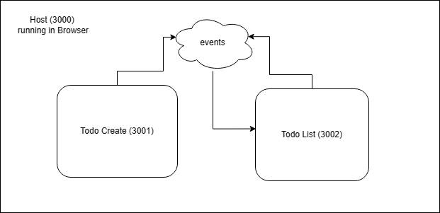
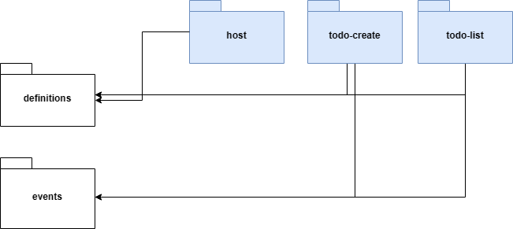

# MFE Todo Application

The solution for this assesment consider as core two remote applications: **todo-create** and **todo-list**, crafted to streamline task management processes.

**todo-create** stands as the gateway for users to initiate new tasks with utmost ease. Through its intuitive interface, users navigate seamlessly, crafting to-do items effortlessly.

On the other hand, **todo-list** provides users with a comprehensive overview of their pending tasks. With seamless integration into the application ecosystem, users efficiently manage their to-do lists and monitor progress. This remote app serves as a centralized hub for task management, fostering a cohesive user experience.

Central to the proposed solution is an event-driven architecture, facilitating seamless communication between the main application and its remote counterparts. Through orchestrated events, the application ensures real-time updates and maintains consistency across all modules.

In summary, the proposed MFE application represents a forward-thinking solution. Through modular scalability, intuitive design, and efficient communication offers the posibility to keep adding popular and useful fuctionalities.

  


As a developer, I care about creating and maintaining projects with good practices and easy to understand structures for other developers interested in read or use my code.
Using monorepos and libraries in this kind of projects allows me to keep my code well organized. Here you can find the package diagram for my proposed solution.



### Events package

It wraps the dispatch and listener events based on the window API. Having this wrapper allows me to update the methods without affecting the remote and host apps. The best example i can mention to you is...what if i want to run my application with SSR? 
Well, the window variable will not be available, so I have to find a different way to emit and listen to events.
I would make that change directly in the library and not have to go to the final applications to make changes unless strictly necessary.

### Definitions Package
My definition package is nothing more than that. The interfaces and enums you need, will be in one place, facilitating the propagation of changes, avoiding duplicate code and errors at development time.


## How to run?


1.  From root, install the dependencies running 
```
yarn install
```

1.  From root, build the dependencies 
```
yarn build
```

1. Go to `apps/todo-list` and run
```
yarn start
```

2. Go to `apps/todo-create` and run
```
yarn start
```

3. Go to `apps/host` and run
```
yarn start
```

You can see the apps running in your localhost.

- Todo Create: http://localhost:3001
- Todo List: http://localhost:3002
- Host app: http://localhost:300

### Utilities

This Turborepo has some additional tools already setup for you:

- [TypeScript](https://www.typescriptlang.org/) for static type checking
- [ESLint](https://eslint.org/) for code linting
- [Prettier](https://prettier.io) for code formatting

### Test

To run all apps and packages test cases, run the following command:

```
yarn test
```

or even better
```
yarn test:coverage
```

### Develop

To develop all apps and packages, run the following command:

```
cd my-turborepo
pnpm dev
```

### Remote Caching

Turborepo can use a technique known as [Remote Caching](https://turbo.build/repo/docs/core-concepts/remote-caching) to share cache artifacts across machines, enabling you to share build caches with your team and CI/CD pipelines.

By default, Turborepo will cache locally. To enable Remote Caching you will need an account with Vercel. If you don't have an account you can [create one](https://vercel.com/signup), then enter the following commands:

```
cd my-turborepo
npx turbo login
```

This will authenticate the Turborepo CLI with your [Vercel account](https://vercel.com/docs/concepts/personal-accounts/overview).

Next, you can link your Turborepo to your Remote Cache by running the following command from the root of your Turborepo:

```
npx turbo link
```

## Useful Links

Learn more about the power of Turborepo:

- [Tasks](https://turbo.build/repo/docs/core-concepts/monorepos/running-tasks)
- [Caching](https://turbo.build/repo/docs/core-concepts/caching)
- [Remote Caching](https://turbo.build/repo/docs/core-concepts/remote-caching)
- [Filtering](https://turbo.build/repo/docs/core-concepts/monorepos/filtering)
- [Configuration Options](https://turbo.build/repo/docs/reference/configuration)
- [CLI Usage](https://turbo.build/repo/docs/reference/command-line-reference)
